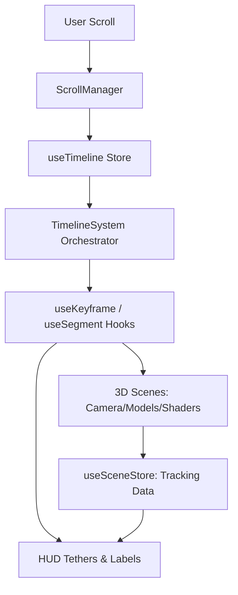

# System Architecture & Project Map

This document provides a high-level map of the `przojectxyz` architecture, focusing on the **Cinematic Timeline System** and the **HUD UI Layer**.

## 🗺 Project Structure

### 🎥 Core Engine (`src/core`)
- **[timeline/timeline.ts](file:///Users/riza/Developments/przojectxyz/src/core/timeline/timeline.ts)**: The interpolation logic (keyframe math).
- **[timeline/useKeyframe.ts](file:///Users/riza/Developments/przojectxyz/src/core/timeline/useKeyframe.ts)**: React hooks (`useKeyframe`, `useSegment`) for component binding.
- **[timeline/ScrollManager.tsx](file:///Users/riza/Developments/przojectxyz/src/core/timeline/ScrollManager.tsx)**: Bridges physical scroll (GSAP ScrollTrigger) to the 1D global progress.
- **[timeline/TimelineSystem.tsx](file:///Users/riza/Developments/przojectxyz/src/core/timeline/TimelineSystem.tsx)**: The main orchestrator that updates the store on every frame.

### 📊 State Management (`src/store`)
- **[useTimeline.ts](file:///Users/riza/Developments/przojectxyz/src/store/useTimeline.ts)**: Global progress store (0 → 1).
- **[useSceneStore.ts](file:///Users/riza/Developments/przojectxyz/src/store/useSceneStore.ts)**: Stores 2D tracking coordinates for HUD "tethering" from 3D objects.

### 🖼 UI & HUD Layer (`src/ui`)
- **[Overlay.tsx](file:///Users/riza/Developments/przojectxyz/src/ui/Overlay.tsx)**: The persistent HUD frame (corners, status bar).
- **sections/**: Modular UI layers for each cinematic act (`IntroText`, `HeroText`, `ProjectsText`).
- **hooks/useTextAnimation.ts**: Technical animation logic (HUD jitter, scanning stagger).
- **components/SplitText.tsx**: Utility for granular character-level animations.

### 🧊 3D World (`src/scenes`)
- **CameraRig.tsx**: Cinematic camera path driven by timeline keyframes.
- **Scene Modules**: (`IntroScene`, `HeroScene`, `ProjectsScene`) - 3D content that synchronizes materials and transforms to the timeline.

## 🔄 Data & Animation Flow

## 🎨 HUD Aesthetic Principles
1.  **Asymmetry**: UI elements are pushed to the edges (`align-left`, `align-right`) to frame the 3D viewport.
2.  **Tethering**: UI labels are visually "anchored" to 3D meshes via lead lines using screen-space coordinates.
3.  **High Contrast**: All HUD elements use `mix-blend-exclusion` to ensure legibility over dynamic WebGL backgrounds.
4.  **Technical Readout**: Every section includes metadata (SYSTEM_BOOT, EXECUTING, DATA_STREAM) and real-time status (BUFFER %).
